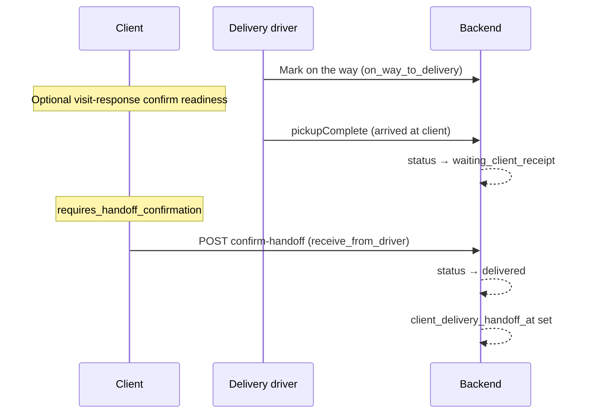
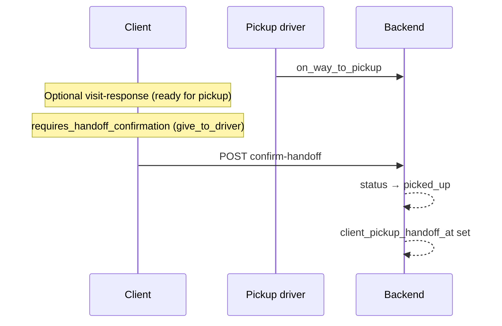
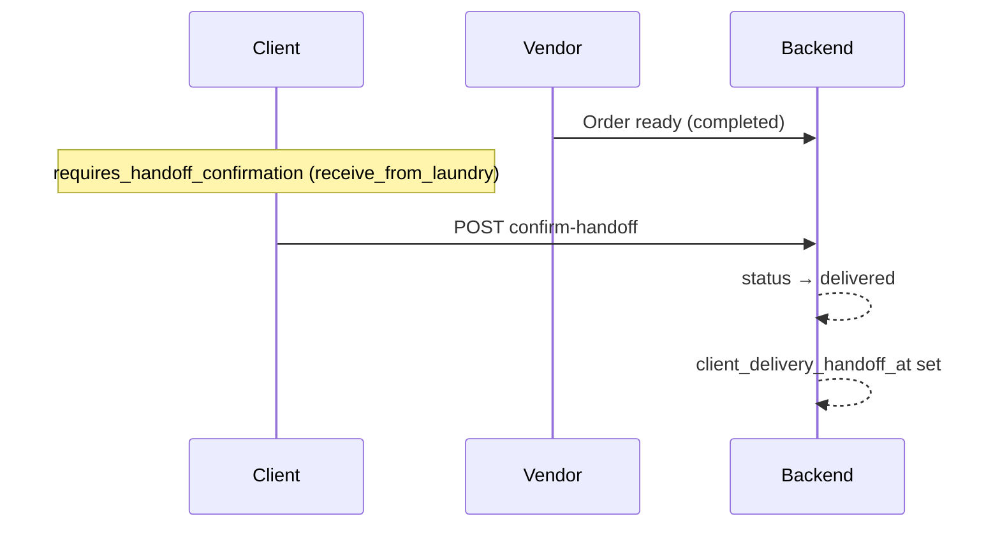

# Client Order Confirmation — Guide

> Arabic version: [CLIENT_ORDER_CONFIRMATION_AR.md](./CLIENT_ORDER_CONFIRMATION_AR.md)

## Overview

On the client **actions / on-the-way** screen, the app may ask the customer to confirm something. There are **two different confirmation flows** — they are not the same action.

| Flow | Purpose | Endpoint | API flag |
|------|---------|----------|----------|
| **Handoff confirmation** | Confirm clothes were **actually** given or received | `POST /api/v1/user/orders/{id}/confirm-handoff` | `requires_handoff_confirmation` |
| **Visit response** | Confirm **readiness** for pickup/delivery, or **postpone** | `POST /api/v1/user/orders/{id}/visit-response` | `requires_visit_response` |

**Priority on the actions card:** if both are available, **handoff** is shown first (actual transfer is more important than readiness).

**Core services:**

- `App\Services\ClientOrderHandoffService` — handoff logic
- `App\Services\ClientOrderVisitService` — visit readiness / postpone logic

---

## 1. Handoff confirmation (`confirm-handoff`)

The client confirms the **physical handoff** of laundry: gave clothes to driver/laundry, or received clothes from driver/laundry.

### Endpoint

```
POST /api/v1/user/orders/{orderId}/confirm-handoff
```

**Auth:** `Bearer <client_token>`

**Request body:** empty or optional fields (no required body).

```json
{}
```

### When it appears (`resolveHandoffContext`)

Logic depends on **order status**, **pickup/delivery mode** (`pickup_at_vendor`, `delivery_at_vendor`), and whether handoff was already confirmed (`client_*_handoff_at`).

| Handoff type | Scenario | Conditions | After confirm |
|--------------|----------|------------|---------------|
| `give_to_driver` | Home pickup — client gives clothes to pickup driver | `pickup_at_vendor = false` · `status = on_way_to_pickup` · `client_pickup_handoff_at` empty | Status → `picked_up` · sets `client_pickup_handoff_at` |
| `give_to_laundry` | Branch drop-off — client gives clothes at laundry | `pickup_at_vendor = true` · `status = confirmed` or `payment_confirmed` · `client_pickup_handoff_at` empty | Sets `client_pickup_handoff_at` only (no status change) |
| `receive_from_driver` | Home delivery — client receives from delivery driver | `delivery_at_vendor = false` · `status = waiting_client_receipt` or `delivered` · `client_delivery_handoff_at` empty | Status → `delivered` · sets `client_delivery_handoff_at` · COD marked paid if applicable |
| `receive_from_laundry` | Branch pickup — client collects from laundry | `delivery_at_vendor = true` · `status = completed` · `client_delivery_handoff_at` empty | Status → `delivered` · sets `client_delivery_handoff_at` · COD if applicable |

### Driver ↔ client scenarios

#### Pickup driver collects from client (home)

1. Driver assigned → en route → `on_way_to_pickup`
2. Client sees **confirm handoff** — “give to driver” (`give_to_driver`)
3. Client confirms → `picked_up` + `client_pickup_handoff_at`

Driver may also complete pickup via driver API (`pickupComplete` from `on_way_to_pickup`); client handoff is the **client-owned** confirmation path.

#### Delivery driver delivers to client (home)

1. Driver starts trip → `on_way_to_delivery`
2. Driver marks arrival (`pickupComplete` while delivery driver + `on_way_to_delivery`) → **`waiting_client_receipt`** (not `delivered`)
3. Client sees **confirm handoff** — “receive from driver” (`receive_from_driver`)
4. Client confirms → `delivered` + `client_delivery_handoff_at`

**Important:** the delivery driver **cannot** finalize delivery alone. Final delivery is confirmed by the **client only** (or equivalent client APIs such as `confirm-delivery` on tracking).

---

## 2. Visit response (`visit-response`)

The client confirms they are **ready** for the driver visit, or **postpones** with reason and new time. This does **not** replace handoff confirmation.

### Endpoint

```
POST /api/v1/user/orders/{orderId}/visit-response
```

**Auth:** `Bearer <client_token>`

### Request body

| Field | Type | Required | Description |
|-------|------|----------|-------------|
| `action` | string | Yes | `confirm` or `postpone` |
| `reason` | string | If `postpone` | Postpone reason |
| `rescheduled_at` | datetime | If `postpone` | New scheduled time |

**Confirm readiness:**

```json
{
  "action": "confirm"
}
```

**Postpone:**

```json
{
  "action": "postpone",
  "reason": "Not at home",
  "rescheduled_at": "2026-08-06T14:00:00+03:00"
}
```

### When it appears (`resolveVisitContext`)

| Visit type | Scenario | Conditions | Effect |
|------------|----------|------------|--------|
| `pickup` | Ready for pickup driver | Home pickup · `on_way_to_pickup` (or driver notified client via `driver_pickup_notified_client_at`) · `client_pickup_visit_confirmed_at` empty | Sets visit timestamps · notifies vendor/driver · **no status change** |
| `delivery` | Ready for delivery driver | Home delivery · `on_way_to_delivery` · `client_delivery_visit_confirmed_at` empty | Same — readiness only |
| `receipt` | Acknowledge receipt prompt | Home delivery · `waiting_client_receipt` or `delivered` · `client_visit_confirmed_at` empty | Sets `client_visit_confirmed_at` · **no status change** |

**Branch drop-off / branch pickup** at the laundry use **handoff** (`give_to_laundry` / `receive_from_laundry`), not visit-response.

### Statuses that allow visit response

| Leg | Allowed statuses |
|-----|------------------|
| Pickup visit | `on_way_to_pickup` |
| Delivery visit | `on_way_to_delivery` |
| Receipt acknowledgment | `waiting_client_receipt`, `delivered` |

Defined in `App\Enums\OrderStatus::clientPickupVisitResponseStatusValues()`, `clientDeliveryVisitResponseStatusValues()`, `clientReceiptConfirmStatusValues()`.

---

## 3. Where the client sees the actions card

The on-the-way / actions UI is driven by client order APIs, mainly:

- `GET /api/v1/user/orders/on-the-way` (and related list endpoints)
- `GET /api/v1/user/orders/{id}` when the order qualifies for tracking

An order appears on the actions card when **any** of these is true:

- `ClientOrderHandoffService::canConfirmHandoff()`
- `ClientOrderVisitService::canRespond()`
- Vendor/client branch handoff tracking (`VendorOrderHandoffService::isClientHandoffTrackable`)
- Pending branch pickup receipt (`isPendingBranchPickupReceipt`)
- Laundry review pending approval (`branch_review`)

### Response flags (client payload)

| Field | Meaning |
|-------|---------|
| `requires_handoff_confirmation` | Show handoff confirm button |
| `requires_visit_response` | Show visit confirm / postpone |
| `waiting_for` | `client` · `vendor` · or null |
| `available_actions` | Handoff actions **or** visit actions (handoff wins if both) |
| `handoff` | Type, direction, label, endpoint |
| `visit` | Type, labels, postpone options, endpoint |

Example handoff block:

```json
{
  "requires_handoff_confirmation": true,
  "handoff": {
    "type": "receive_from_driver",
    "direction": "receive",
    "confirm_label": "Confirm you received your clothes from the driver",
    "endpoint": "/api/v1/user/orders/417/confirm-handoff",
    "confirm_action": "confirm"
  }
}
```

---

## 4. Order fields (confirmation tracking)

| Field | Meaning |
|-------|---------|
| `client_pickup_handoff_at` | Client **gave** clothes (to driver or at branch) |
| `client_delivery_handoff_at` | Client **received** clothes (from driver or at branch) |
| `client_pickup_visit_confirmed_at` | Client confirmed **ready** for pickup visit |
| `client_delivery_visit_confirmed_at` | Client confirmed **ready** for delivery visit |
| `client_visit_confirmed_at` | General visit acknowledgment (e.g. receipt type) |
| `driver_pickup_notified_client_at` | Driver notified client they are on the way to pickup |
| `client_postponed_at` / `client_postpone_reason` | Client postponed a visit |

If the client postpones after confirming readiness, postpone timestamps can invalidate prior visit confirmations (logic in `hasConfirmedPickupVisit` / `hasConfirmedDeliveryVisit`).

---

## 5. End-to-end flows

### Home delivery — driver delivers to client



### Home pickup — driver collects from client



### Branch pickup — client collects from laundry



---

## 6. Related driver behavior (reference)

| Driver action | Status change | Client next step |
|---------------|---------------|------------------|
| Pickup driver · `pickupComplete` from `on_way_to_pickup` | → `picked_up` | Handoff may already be done by client or driver path |
| Delivery driver · `pickupComplete` from `on_way_to_delivery` | → `waiting_client_receipt` | Client must `confirm-handoff` (`receive_from_driver`) |
| Delivery driver · `confirm-qr` at delivery | Does **not** complete delivery to client | Client still confirms receipt |

Driver delivery completion message (Arabic): *“تم الوصول لموقع التسليم — في انتظار تأكيد العميل للاستلام”*.

---

## 7. Troubleshooting — why no confirm button?

Check on the order record:

1. **Status** — matches one of the handoff or visit rules above?
2. **Mode** — `pickup_at_vendor` / `delivery_at_vendor` correct for the scenario?
3. **Already confirmed** — `client_pickup_handoff_at` or `client_delivery_handoff_at` already set?
4. **Wrong flow** — expecting visit-response while handoff is required (or vice versa)?
5. **Delivery** — is status still `on_way_to_delivery`? Client handoff for receipt usually needs `waiting_client_receipt` (after driver marks arrival).

### Quick server check (tinker)

```bash
php artisan tinker --execute='$id = 417; $o = \Modules\Order\Models\Order::withoutGlobalScopes()->find($id); $h = app(\App\Services\ClientOrderHandoffService::class); $v = app(\App\Services\ClientOrderVisitService::class); dump(["status"=>$o->status,"pickup_at_vendor"=>$o->pickup_at_vendor,"delivery_at_vendor"=>$o->delivery_at_vendor,"client_pickup_handoff_at"=>$o->client_pickup_handoff_at,"client_delivery_handoff_at"=>$o->client_delivery_handoff_at,"can_handoff"=>$h->canConfirmHandoff($o),"handoff"=>$h->resolveHandoffContext($o),"can_visit"=>$v->canRespond($o),"visit"=>$v->resolveVisitContext($o)]);'
```

---

## 8. Code references

| Area | Location |
|------|----------|
| Handoff rules | `app/Services/ClientOrderHandoffService.php` |
| Visit rules | `app/Services/ClientOrderVisitService.php` |
| Client confirm-handoff API | `Modules/Order/.../User/OrderController.php` → `confirmHandoff()` |
| Client visit-response API | `Modules/Order/.../User/OrderController.php` → `visitResponse()` |
| On-the-way card payload | `OrderController` → on-the-way mapping (`requires_handoff_confirmation`, `requires_visit_response`) |
| Driver arrival → waiting client | `Modules/Driver/.../OrderController.php` → `pickupComplete()` |
| Status enums | `app/Enums/OrderStatus.php` |

---

## See also

- [CLIENT_ORDER_CONFIRMATION_AR.md](./CLIENT_ORDER_CONFIRMATION_AR.md) — Arabic version of this guide
- [VENDOR_CONFIRM_HANDOFF.md](./VENDOR_CONFIRM_HANDOFF.md) — vendor/laundry handoff with drivers (separate from client confirmation)
