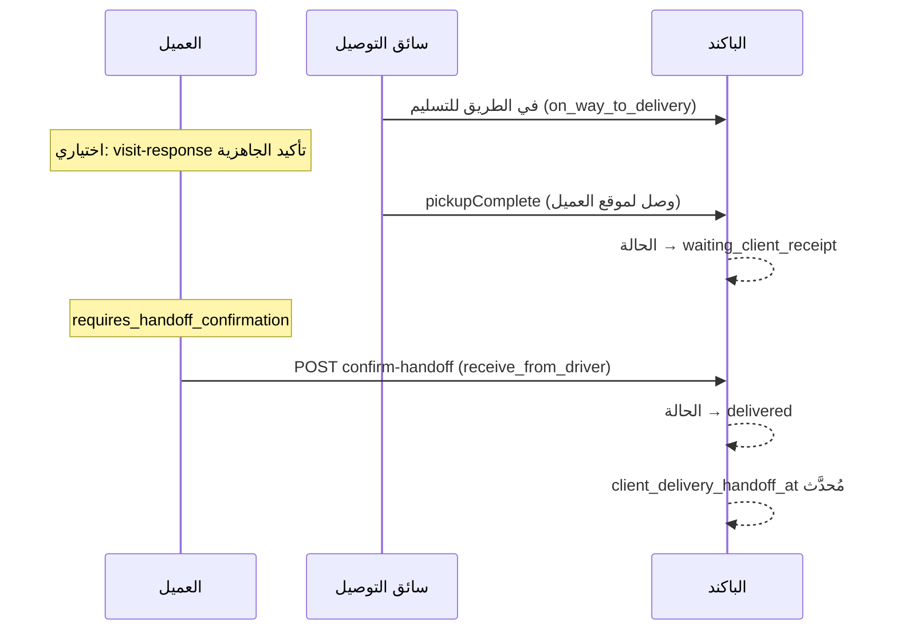
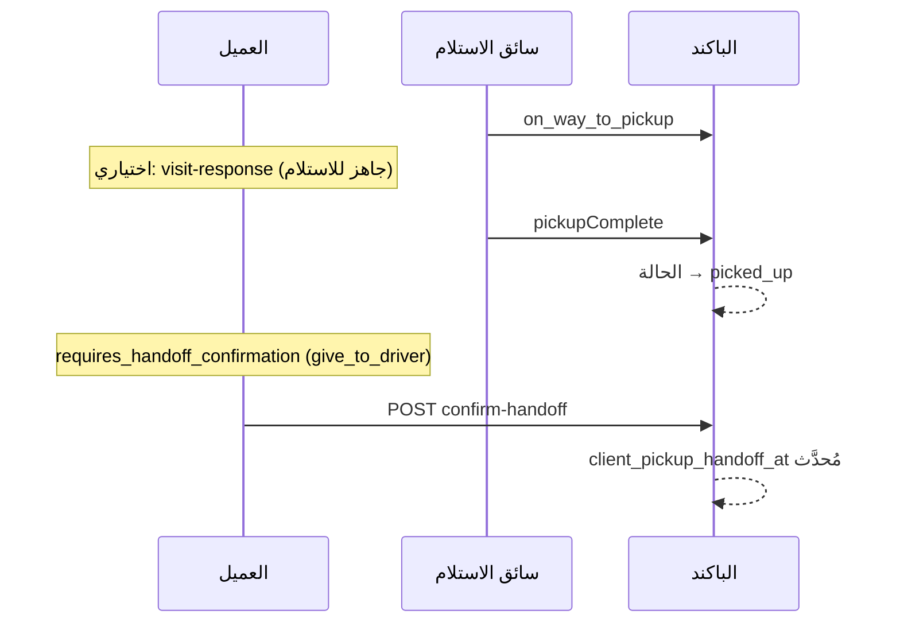
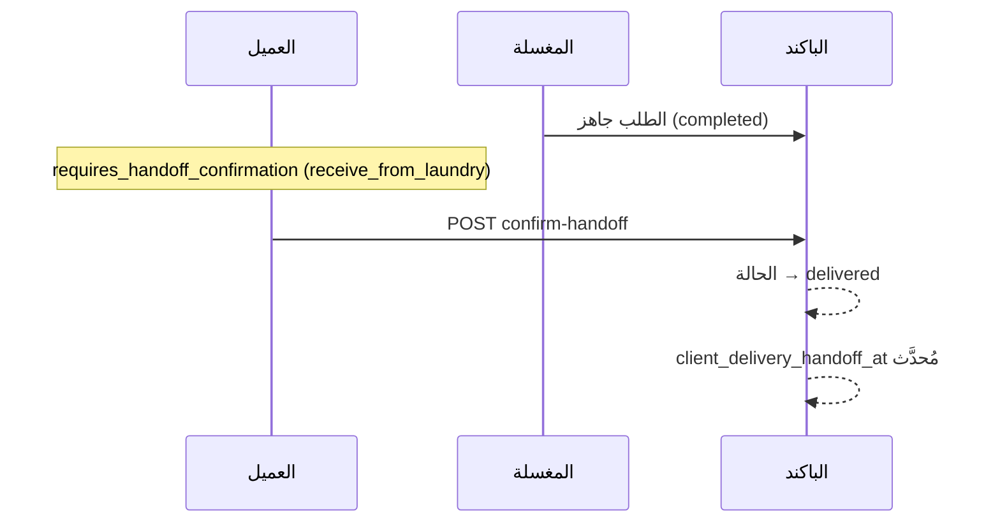

# تأكيد الطلب من العميل — دليل

> النسخة الإنجليزية: [CLIENT_ORDER_CONFIRMATION.md](./CLIENT_ORDER_CONFIRMATION.md)

## نظرة عامة

في شاشة **الإجراءات / في الطريق** قد يُطلب من العميل تأكيد شيء ما. يوجد **نوعان مختلفان** من التأكيد — ليسا نفس الإجراء.

| المسار | الغرض | Endpoint | Flag في API |
|--------|--------|----------|-------------|
| **تأكيد التسليم الفعلي (Handoff)** | تأكيد أن الملابس **اتسلمت فعلاً** (سلّم أو استلم) | `POST /api/v1/user/orders/{id}/confirm-handoff` | `requires_handoff_confirmation` |
| **رد على الزيارة (Visit)** | تأكيد **الجاهزية** للاستلام/التوصيل، أو **التأجيل** | `POST /api/v1/user/orders/{id}/visit-response` | `requires_visit_response` |

**الأولوية في كارد الإجراءات:** إذا كان كلاهما متاحًا، يُعرض **Handoff أولاً** (التسليم الفعلي أهم من تأكيد الجاهزية).

**الخدمات الأساسية في الكود:**

- `App\Services\ClientOrderHandoffService` — منطق التسليم الفعلي
- `App\Services\ClientOrderVisitService` — منطق الجاهزية والتأجيل

---

## 1. تأكيد التسليم الفعلي (`confirm-handoff`)

العميل يؤكد **التسليم المادي** للملابس: سلّم للسائق/المغسلة، أو استلم من السائق/المغسلة.

### Endpoint

```
POST /api/v1/user/orders/{orderId}/confirm-handoff
```

**المصادقة:** `Bearer <client_token>`

**Body:** فارغ أو حقول اختيارية (لا يوجد body مطلوب).

```json
{}
```

### متى يظهر؟ (`resolveHandoffContext`)

يعتمد على **حالة الطلب**، **نوع الاستلام/التوصيل** (`pickup_at_vendor`, `delivery_at_vendor`)، وهل تم التأكيد مسبقًا (`client_*_handoff_at`).

| نوع Handoff | السيناريو | الشروط | بعد التأكيد |
|-------------|-----------|--------|-------------|
| `give_to_driver` | استلام من البيت — العميل يؤكد أنه سلّم للمندوب **بعد** ما السائق يعمل pickup | `pickup_at_vendor = false` · `status = picked_up` · `client_pickup_handoff_at` فارغ | يُحدَّث `client_pickup_handoff_at` فقط (الحالة أصلًا `picked_up`) |
| `give_to_laundry` | تسليم في الفرع — العميل يسلّم في المغسلة | `pickup_at_vendor = true` · `status = confirmed` أو `payment_confirmed` · `client_pickup_handoff_at` فارغ | يُحدَّث `client_pickup_handoff_at` فقط (بدون تغيير الحالة) |
| `receive_from_driver` | توصيل للبيت — العميل يستلم من سائق التوصيل | `delivery_at_vendor = false` · `status = waiting_client_receipt` أو `delivered` · `client_delivery_handoff_at` فارغ | الحالة → `delivered` · يُحدَّث `client_delivery_handoff_at` · COD يُسجَّل مدفوع إن وُجد |
| `receive_from_laundry` | استلام من الفرع — العميل يستلم من المغسلة | `delivery_at_vendor = true` · `status = completed` · `client_delivery_handoff_at` فارغ | الحالة → `delivered` · يُحدَّث `client_delivery_handoff_at` · COD إن وُجد |

### سيناريوهات السائق ↔ العميل

#### سائق الاستلام يستلم من العميل (من البيت)

1. تعيين السائق → في الطريق → `on_way_to_pickup`
2. السائق يعمل pickup complete → الحالة تصبح `picked_up`
3. العميل يرى **تأكيد التسليم** — «سلّمت الملابس للمندوب» (`give_to_driver`)
4. العميل يؤكد → يُحدَّث `client_pickup_handoff_at` (الحالة تبقى `picked_up`)

**مهم:** سائق الاستلام هو من ينقل الحالة إلى `picked_up`. تأكيد العميل بعد ذلك إقرار بالتسليم، وليس هو من ينشئ حالة الاستلام.

#### سائق التوصيل يسلّم للعميل (توصيل للبيت)

1. السائق يبدأ الرحلة → `on_way_to_delivery`
2. السائق يضغط «وصلت» (`pickupComplete` وسائق توصيل + `on_way_to_delivery`) → **`waiting_client_receipt`** (وليس `delivered`)
3. العميل يرى **تأكيد التسليم** — «استلم من السائق» (`receive_from_driver`)
4. العميل يؤكد → `delivered` + `client_delivery_handoff_at`

**مهم:** سائق التوصيل **لا يمكنه** إنهاء التسليم بنفسه. الإنهاء النهائي يكون من **العميل فقط** (أو APIs مكافئة مثل `confirm-delivery` في التتبع).

---

## 2. رد على الزيارة (`visit-response`)

العميل يؤكد أنه **جاهز** لزيارة السائق، أو **يؤجّل** مع سبب ووقت جديد. هذا **لا يغني** عن تأكيد التسليم الفعلي.

### Endpoint

```
POST /api/v1/user/orders/{orderId}/visit-response
```

**المصادقة:** `Bearer <client_token>`

### Request body

| الحقل | النوع | مطلوب | الوصف |
|-------|------|-------|--------|
| `action` | string | نعم | `confirm` أو `postpone` |
| `reason` | string | عند `postpone` | سبب التأجيل |
| `rescheduled_at` | datetime | عند `postpone` | الوقت الجديد |

**تأكيد الجاهزية:**

```json
{
  "action": "confirm"
}
```

**التأجيل:**

```json
{
  "action": "postpone",
  "reason": "لست في المنزل",
  "rescheduled_at": "2026-08-06T14:00:00+03:00"
}
```

### متى يظهر؟ (`resolveVisitContext`)

| نوع الزيارة | السيناريو | الشروط | التأثير |
|-------------|-----------|--------|---------|
| `pickup` | جاهز لسائق الاستلام | استلام من البيت · `on_way_to_pickup` (أو السائق أرسل إشعار «في الطريق» `driver_pickup_notified_client_at`) · `client_pickup_visit_confirmed_at` فارغ | يُحدَّث وقت الزيارة · إشعار للمغسلة/السائق · **بدون تغيير الحالة** |
| `delivery` | جاهز لسائق التوصيل | توصيل للبيت · `on_way_to_delivery` · `client_delivery_visit_confirmed_at` فارغ | نفس الشيء — جاهزية فقط |
| `receipt` | إقرار استلام | توصيل للبيت · `waiting_client_receipt` أو `delivered` · `client_visit_confirmed_at` فارغ | يُحدَّث `client_visit_confirmed_at` · **بدون تغيير الحالة** |

**التسليم/الاستلام في الفرع** يستخدمان **handoff** (`give_to_laundry` / `receive_from_laundry`) وليس visit-response.

### الحالات المسموحة لرد الزيارة

| المرحلة | الحالات المسموحة |
|---------|------------------|
| زيارة استلام | `on_way_to_pickup` |
| زيارة توصيل | `on_way_to_delivery` |
| إقرار استلام | `waiting_client_receipt`, `delivered` |

مُعرَّفة في `App\Enums\OrderStatus::clientPickupVisitResponseStatusValues()` و `clientDeliveryVisitResponseStatusValues()` و `clientReceiptConfirmStatusValues()`.

---

## 3. أين يرى العميل كارد الإجراءات؟

واجهة «في الطريق / الإجراءات» تعتمد على APIs الطلبات للعميل، أهمها:

- `GET /api/v1/user/orders/on-the-way` (و endpoints القوائم المرتبطة)
- `GET /api/v1/user/orders/{id}` عندما يكون الطلب مؤهل للتتبع

يظهر الطلب في كارد الإجراءات عندما **أي** من التالي صحيح:

- `ClientOrderHandoffService::canConfirmHandoff()`
- `ClientOrderVisitService::canRespond()`
- تتبع handoff الفرع (`VendorOrderHandoffService::isClientHandoffTrackable`)
- استلام معلّق من الفرع (`isPendingBranchPickupReceipt`)
- مراجعة المغسلة بانتظار موافقة العميل (`branch_review`)

### Flags في الـ response

| الحقل | المعنى |
|-------|--------|
| `requires_handoff_confirmation` | إظهار زر تأكيد التسليم الفعلي |
| `requires_visit_response` | إظهار تأكيد الجاهزية / التأجيل |
| `waiting_for` | `client` · `vendor` · أو null |
| `available_actions` | إجراءات handoff **أو** visit (handoff يتقدم إن وُجد كلاهما) |
| `handoff` | النوع، الاتجاه، النص، endpoint |
| `visit` | النوع، النصوص، خيارات التأجيل، endpoint |

مثال على block الـ handoff:

```json
{
  "requires_handoff_confirmation": true,
  "handoff": {
    "type": "receive_from_driver",
    "direction": "receive",
    "confirm_label": "أكّد أنك استلمت الملابس من المندوب",
    "endpoint": "/api/v1/user/orders/417/confirm-handoff",
    "confirm_action": "confirm"
  }
}
```

---

## 4. حقول الطلب (تتبع التأكيد)

| الحقل | المعنى |
|-------|--------|
| `client_pickup_handoff_at` | العميل **سلّم** الملابس (للسائق أو في الفرع) |
| `client_delivery_handoff_at` | العميل **استلم** الملابس (من السائق أو من الفرع) |
| `client_pickup_visit_confirmed_at` | العميل أكد **جاهزيته** لزيارة الاستلام |
| `client_delivery_visit_confirmed_at` | العميل أكد **جاهزيته** لزيارة التوصيل |
| `client_visit_confirmed_at` | إقرار زيارة عام (مثل نوع receipt) |
| `driver_pickup_notified_client_at` | السائق أبلغ العميل أنه في الطريق للاستلام |
| `client_postponed_at` / `client_postpone_reason` | العميل أجّل الزيارة |

إذا أجّل العميل بعد تأكيد الجاهزية، قد تُلغى تأكيدات الزيارة السابقة (منطق `hasConfirmedPickupVisit` / `hasConfirmedDeliveryVisit`).

---

## 5. مسارات العمل الكاملة

### توصيل للبيت — السائق يسلّم للعميل



### استلام من البيت — السائق يستلم من العميل



### استلام من الفرع — العميل يستلم من المغسلة



---

## 6. إجراءات السائق (مرجع)

| إجراء السائق | تغيير الحالة | الخطوة التالية للعميل |
|--------------|--------------|------------------------|
| سائق استلام · `pickupComplete` من `on_way_to_pickup` | → `picked_up` | بعدها العميل يؤكد handoff (`give_to_driver`) |
| سائق توصيل · `pickupComplete` من `on_way_to_delivery` | → `waiting_client_receipt` | العميل يجب أن يعمل `confirm-handoff` (`receive_from_driver`) |
| سائق توصيل · `confirm-qr` عند التسليم | **لا** يُنهي التسليم للعميل | العميل ما زال يؤكد الاستلام |

رسالة السائق عند الوصول (عربي): *«تم الوصول لموقع التسليم — في انتظار تأكيد العميل للاستلام»*.

---

## 7. استكشاف الأخطاء — لماذا لا يظهر زر التأكيد؟

راجع على سجل الطلب:

1. **الحالة** — تطابق أحد قواعد handoff أو visit أعلاه؟
2. **النوع** — `pickup_at_vendor` / `delivery_at_vendor` صحيح للسيناريو؟
3. **تأكيد سابق** — `client_pickup_handoff_at` أو `client_delivery_handoff_at` مُحدَّد مسبقًا؟
4. **مسار خاطئ** — تتوقع visit-response بينما المطلوب handoff (أو العكس)؟
5. **الاستلام** — الحالة ما زالت `on_way_to_pickup`؟ تأكيد العميل لـ give-to-driver يحتاج `picked_up` أولًا (بعد ما السائق يعمل pickup).
6. **التوصيل** — الحالة ما زالت `on_way_to_delivery`؟ تأكيد استلام العميل عادة يحتاج `waiting_client_receipt` (بعد أن السائق يضغط «وصلت»).

### فحص سريع على السيرفر (tinker)

```bash
php artisan tinker --execute='$id = 417; $o = \Modules\Order\Models\Order::withoutGlobalScopes()->find($id); $h = app(\App\Services\ClientOrderHandoffService::class); $v = app(\App\Services\ClientOrderVisitService::class); dump(["status"=>$o->status,"pickup_at_vendor"=>$o->pickup_at_vendor,"delivery_at_vendor"=>$o->delivery_at_vendor,"client_pickup_handoff_at"=>$o->client_pickup_handoff_at,"client_delivery_handoff_at"=>$o->client_delivery_handoff_at,"can_handoff"=>$h->canConfirmHandoff($o),"handoff"=>$h->resolveHandoffContext($o),"can_visit"=>$v->canRespond($o),"visit"=>$v->resolveVisitContext($o)]);'
```

---

## 8. مراجع الكود

| المجال | المسار |
|--------|--------|
| قواعد Handoff | `app/Services/ClientOrderHandoffService.php` |
| قواعد Visit | `app/Services/ClientOrderVisitService.php` |
| API confirm-handoff | `Modules/Order/.../User/OrderController.php` → `confirmHandoff()` |
| API visit-response | `Modules/Order/.../User/OrderController.php` → `visitResponse()` |
| payload كارد في الطريق | `OrderController` → on-the-way mapping |
| وصول السائق → انتظار العميل | `Modules/Driver/.../OrderController.php` → `pickupComplete()` |
| تعداد الحالات | `app/Enums/OrderStatus.php` |

---

## انظر أيضًا

- [VENDOR_CONFIRM_HANDOFF.md](./VENDOR_CONFIRM_HANDOFF.md) — تأكيد المغسلة مع السائقين (منفصل عن تأكيد العميل)
- [CLIENT_ORDER_CONFIRMATION.md](./CLIENT_ORDER_CONFIRMATION.md) — النسخة الإنجليزية من هذا الدليل
